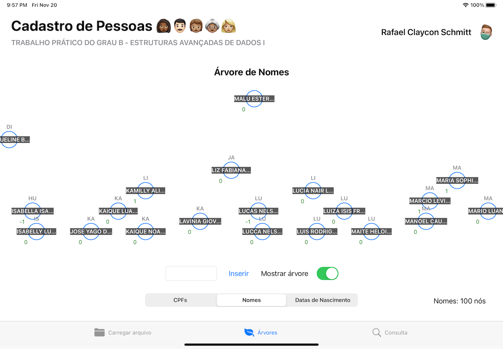

# Cadastro de Pessoas AVL

Este é um app para iPadOS que consiste em carregar um arquivo CSV com dados de pessoas e permitir a pesquisa desses dados através de 3 campos indexados: CPF, Nome e Data de Nascimento. A indexação ocorre por meio de árvores AVL implementadas pelo próprio autor.

Este é um trabalho da disciplina de Estruturas Avançadas de Dados I da Unisinos, publicado aqui para referência e estudo da linguagem Swift.

