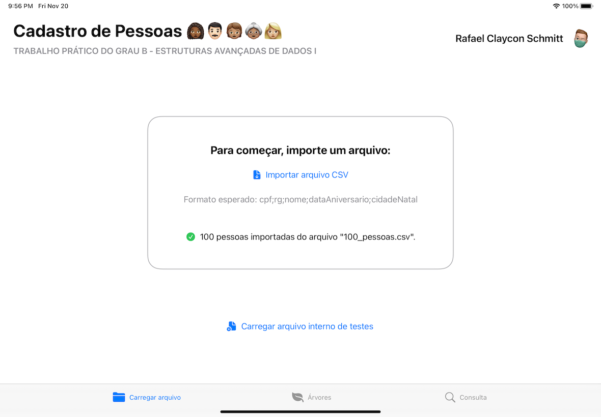
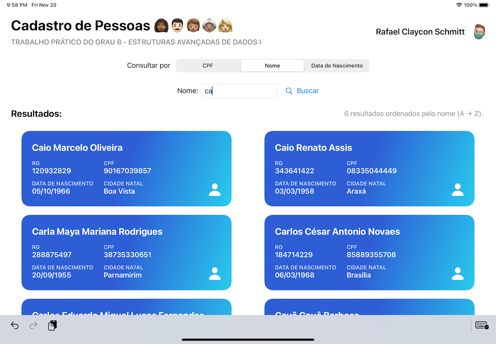

# Cadastro de Pessoas AVL

Este é um app para iOS que consiste em carregar um arquivo CSV com dados de pessoas e permitir a pesquisa desses dados através de 3 campos indexados: CPF, Nome e Data de Nascimento. A indexação ocorre por meio de árvores AVL implementadas pelo autor.

Este é um trabalho de faculdade publicado aqui para referência.

